# 🛒 Khareedo - Full Stack E-Commerce Website

**Khareedo** is a full-featured e-commerce platform developed as a **Web Development + ADBMS project**. It offers an engaging shopping experience, including modern UI interactions, real-time data handling, and an intuitive user interface for both customers and admins.

Built with the **MERN Stack** (MongoDB, Express.js, React, Node.js) and styled using **CSS** and some **Java components**, it supports full CRUD functionality, authentication, shopping cart, order flow, and responsive design.

---

## 📸 Screenshots

> Screenshots of the landing page, product cards, category hover animation, admin panel, and cart page after deploying.

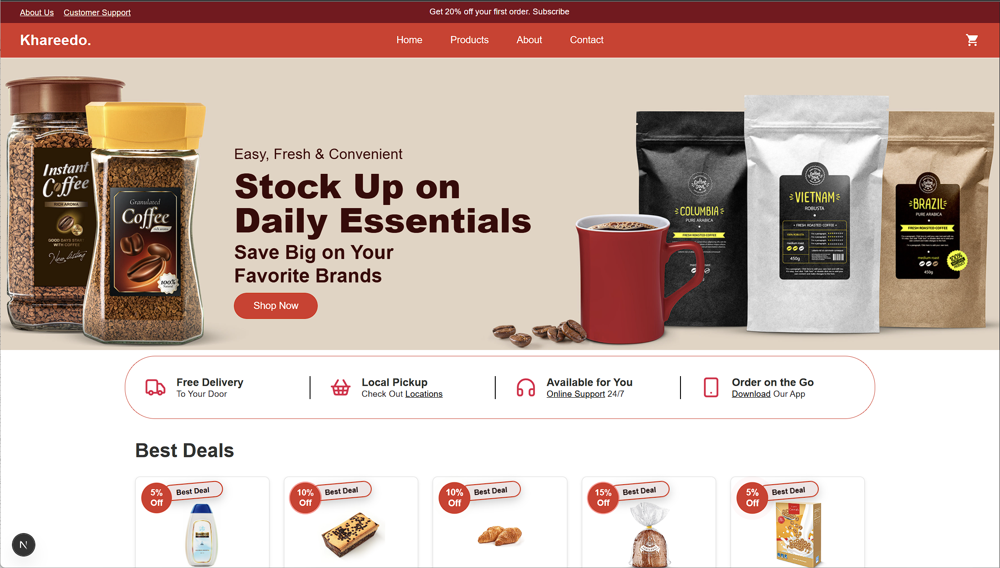 |
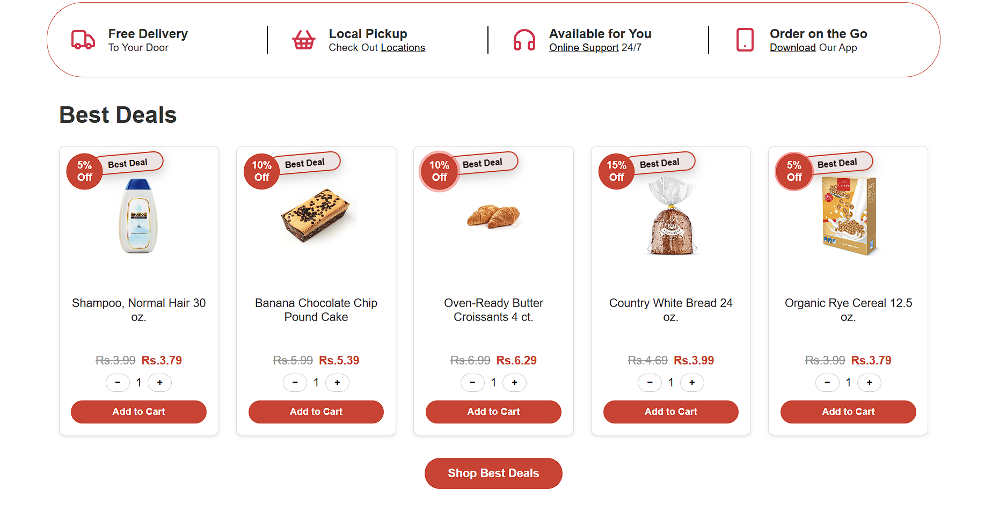 
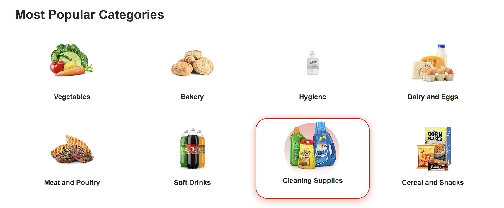 
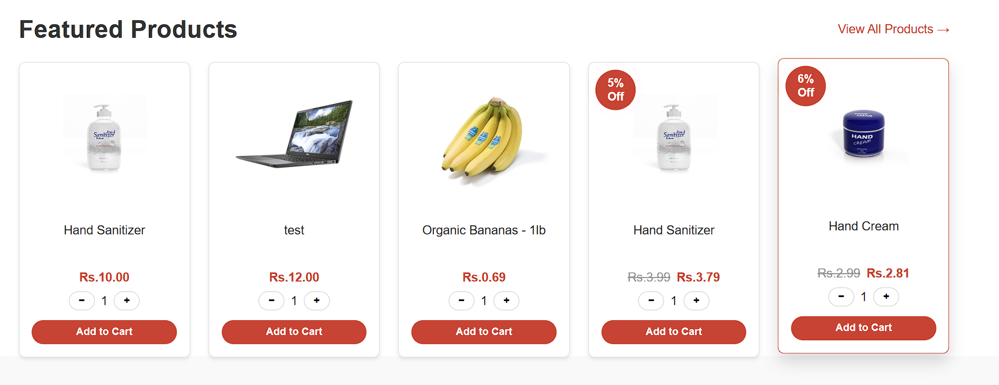 
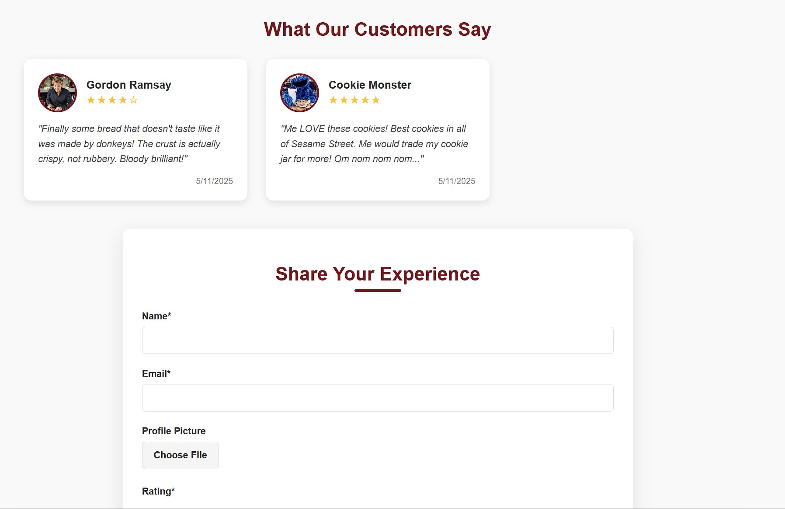 
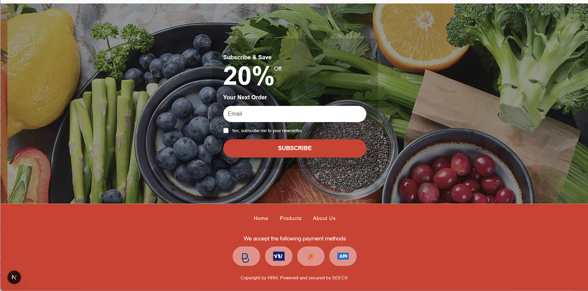 
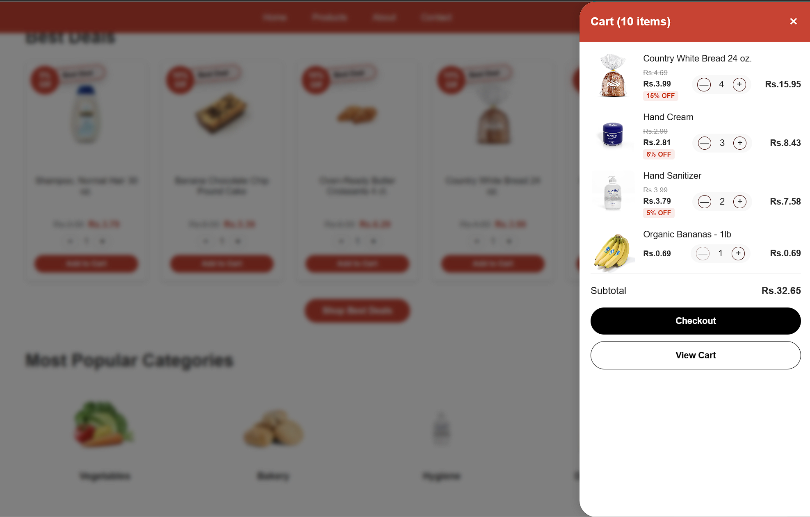 
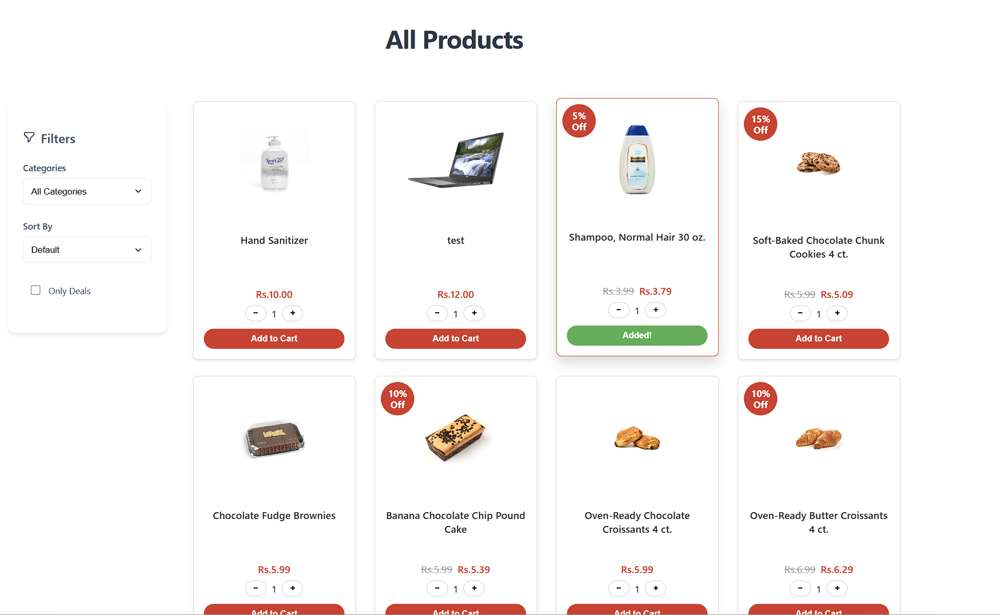 
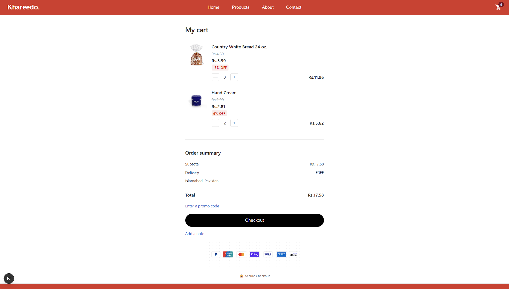 
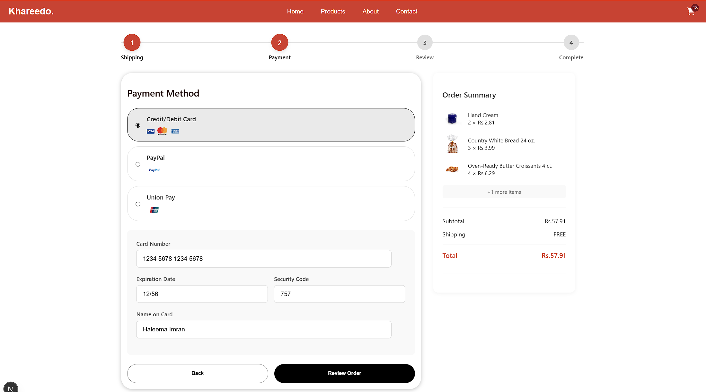 
 
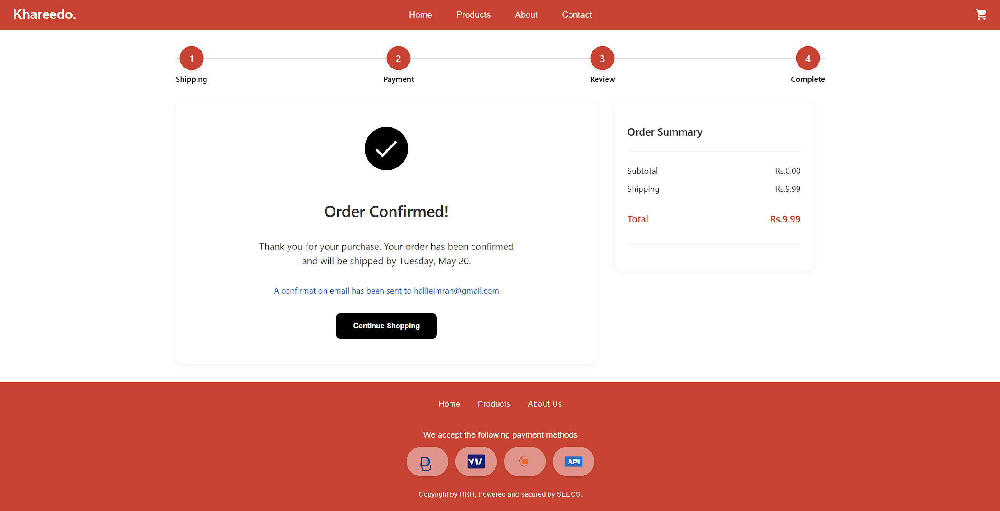 

---

## ✨ Features

### 🛍️ Frontend (React + CSS)
- Home, Products, About, Contact pages
- Product categories with hover effects
- Responsive UI with hover animations on:
  - Product cards  
  - Category tiles
- Shopping Cart and Add to Cart functionality
- Customer reviews and ratings
- Newsletter subscription

### 🔐 Backend (Node.js + Express)
- RESTful API
- User authentication (login/signup)
- Admin authentication
- Product CRUD (Admin only)
- Order management

### 🗂️ Database (MongoDB)
- Products Collection
- Users Collection (Admin/Customer roles)
- Orders & Reviews
- Newsletter Subscribers

---

## 🧪 Technologies Used

| Stack           | Tools & Libraries                          |
|----------------|---------------------------------------------|
| **Frontend**    | React, HTML, CSS, Java                     |
| **Backend**     | Node.js, Express.js                        |
| **Database**    | MongoDB, Mongoose                          |
| **Authentication** | JWT, bcrypt                             |
| **Styling**     | Custom CSS, Flexbox, Media Queries         |
| **UI Effects**  | Hover animations using CSS transitions     |

---

## 📱 Responsive Features

- 💻 Desktop & 📱 Mobile Friendly
- App-like experience with **“Order on the Go”** design
- "Download Our App" promo section
- 24/7 online support area
- Live product stock tracking

---

## 🗣️ Customer Testimonials (Example Data)

> _"Finally some bread that doesn't taste like it was made by donkeys!"_  
— **Gordon Ramsay**, ★★★★☆

> _"Me LOVE these cookies! Best cookies in all of Sesame Street."_  
— **Cookie Monster**, ★★★★★

---

## 📬 Contact & Support

- **About Us**: Know more about Khareedo’s journey
- **Customer Support**: 24/7 service
- **Newsletter**: Subscribe and get **20% OFF** your first order!

---

## 🛠️ Run Locally

### Clone the repo:
```bash
git clone https://github.com/yourusername/khareedo.git
